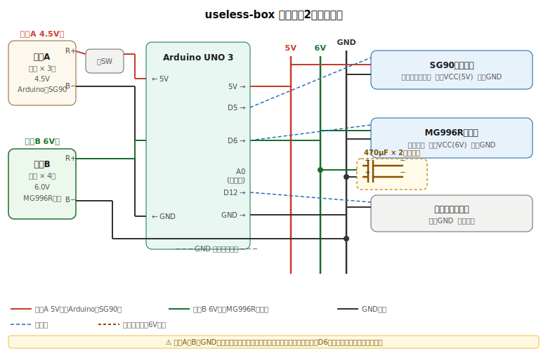
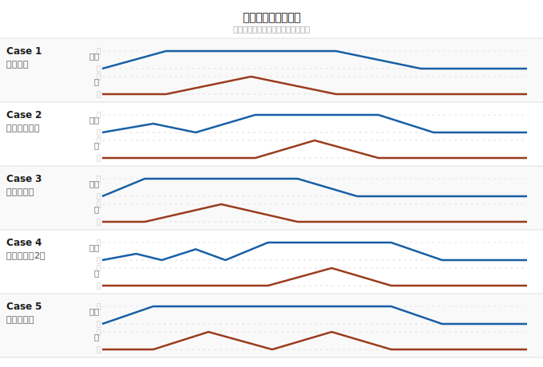

<div align="center">

# 🎁 useless-box

**スイッチを押すと、フタが開き、腕が出てきて、スイッチを押し戻す。それだけの箱。**


*課題研究作品*

</div>

---

## 📖 概要

いわゆる **Useless Box / Useless Machine** の Arduino 実装です。

スイッチを ON にすると:

1. 📦 フタが開く
2. 🦾 中から腕が出てくる
3. 👆 腕がスイッチを OFF に押し戻す
4. 📦 腕が引っ込みフタが閉まる

これを **5種類の性格** でランダムに演じ分けます。

---

## ⚡ 回路

<div align="center">

</div>

### 部品構成

| パーツ | 型番 | 電源系統 | 役割 | ピン |
|:-------|:-----|:--------:|:-----|:----:|
| マイコン | Arduino UNO 3 | 🔴 A (4.5V) | 制御 | — |
| サーボ（フタ） | SG90 | 🔴 A (4.5V) | フタの開閉 | `D5` |
| サーボ（腕） | MG996R | 🟢 B (6.0V) | スイッチを押す腕 | `D6` |
| スイッチ | — | — | トリガー入力 | `D12` |
| 電源A | 単三電池 × 3本 | 🔴 A (4.5V) | Arduino・SG90 給電 | — |
| 電源B | 単三電池 × 4本 | 🟢 B (6.0V) | MG996R 専用給電 | — |
| コンデンサ | 470µF × 2（並列） | 🟢 B (6V系) | 起動スパイク吸収 | MG996R 根本 |

### 🔋 なぜ2電源なのか

MG996R は起動時に **最大 2.5A** を引き込みます。単一電源だとこの瞬間に電圧が降下し、
Arduino がブラウンアウトリセットする問題が発生しました。

| 系統 | 電池 | 電圧 | 給電対象 |
|:----:|:-----|:----:|:---------|
| 🔴 A | 単三 × 3 | 4.5V | Arduino UNO 3・SG90 |
| 🟢 B | 単三 × 4 | 6.0V | MG996R のみ |

電源を分離することで、MG996R の突入電流が制御系に影響しなくなります。
6.0V は MG996R の定格範囲（4.8〜7.2V）内です。

> [!WARNING]
> **電池A・BのGNDは必ず共通接続すること。**
> D6 信号線の基準電位が合わないと MG996R が誤動作します。

### 🔧 実装メモ

- 配線はすべて**はんだ付け＋ホットボンド固定**（ブレッドボード不使用）
- コンデンサは MG996R の VCC（赤）・GND（茶）根本に直接並列接続
- `A0` ピンは**未接続のまま**にする（ランダムシードとして浮遊ノイズを利用）

---

## 🎭 バリエーション

<div align="center">

</div>

| Case | 性格 | 演出 |
|:----:|:-----|:-----|
| 1️⃣ | **ノーマル** | 迷わずスパッと処理する仕事人 |
| 2️⃣ | **ためらいがち** | 半開き → 引き戻し → 諦めて全開 |
| 3️⃣ | **即ブチ切れ** | 全力最速で反応 |
| 4️⃣ | **フェイント2連** | 2回チラ見せしてから本番 |
| 5️⃣ | **連続ノック** | 腕を2回叩きつける激おこ |

`randomSeed(analogRead(A0))` により電源投入ごとにシードが変わるため、
毎回異なる順序でバリエーションが出現します。

---

## 💻 コード設計

### 角度定義

```cpp
const int lidClosed    = 90;   // フタが閉まる角度
const int lidOpen      = 3;    // フタが開く角度
const int armRetracted = 3;    // 腕が格納された角度
const int armExtended  = 110;  // 腕が伸びた角度
```

### サーボ特性に合わせた待機時間

```cpp
const int LID_MOVE_MS = 200;   // SG90   : 90° 動ききる余裕時間
const int ARM_MOVE_MS = 420;   // MG996R : 110° 動ききる余裕時間
```

| サーボ | カタログ速度 | 実必要時間 | 設定値 |
|:-------|:------------:|:----------:|:------:|
| SG90（フタ 90°） | 0.1s/60° | ≈150ms | 200ms |
| MG996R（腕 110°） | 0.17s/60° @4.8V | ≈311ms | 420ms |

> [!TIP]
> 6V 給電では MG996R は約 0.13s/60° に速くなるため、`ARM_MOVE_MS` は
> 実機確認のうえ 300ms 前後まで詰められる可能性があります。

### sweep() — 演技のコア

```cpp
void sweep(Servo &s, int from, int to, int stepDelay) {
  int step = (from < to) ? 1 : -1;
  for (int pos = from; pos != to + step; pos += step) {
    s.write(pos);
    delay(stepDelay);
  }
}
```

SG90 を 1° ずつ動かすことで「ためらい」「フェイント」を表現します。
MG996R はトルクが強く途中停止が不安定なため `write()` 直接制御のみを使用。

### スイッチデバウンス

物理スイッチは押した瞬間に接点がバウンドし、数ミリ秒間 ON/OFF を高速に繰り返します
（チャタリング）。対策として動作シーケンス末尾に `delay(100)` を置き、
バウンドが収まるまで再検出を抑止しています。

---

## 📂 ファイル構成

```
useless-box/
├── useless_box.ino      # メインスケッチ
├── docs/
│   ├── circuit.svg      # 回路図
│   └── variations.svg   # バリエーション タイムライン
└── README.md
```

---

## ⚠️ 注意事項

- MG996R の動作電圧は **4.8〜7.2V**（電源Bの 6.0V は範囲内）
- MG996R は起動時最大 **2.5A** — 電源系統の分離が必須
- `A0` ピンには何も接続しない（ランダムシード用）

## ✍ ライセンス
***MIT***
