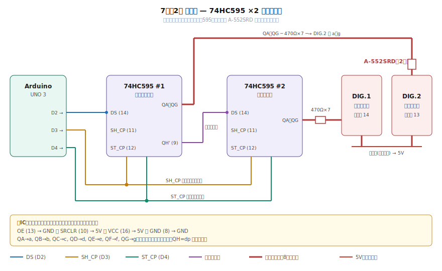

<div align="center">

# 🎁 useless-box

### スイッチを押すと、フタが開き、腕が出てきて、スイッチを押し戻す。<br>それだけの箱。

<br>


<br>

**[概要](#-概要)** ・ **[設計判断](#-設計判断ログ)** ・ **[回路](#-回路)** ・ **[表示部](#-表示部)** ・ **[バリエーション](#-バリエーション)** ・ **[コード](#-コード設計)** ・ **[TODO](#-todo)**

<sub>課題研究作品</sub>

</div>

---

## 📖 概要

いわゆる **Useless Box / Useless Machine** の Arduino 実装です。
押されたら押し返す、ただそれだけの動作を **5種類の性格** で演じ分けます。

```
 押す  →  📦 フタが開く  →  🦾 腕が出る  →  👆 押し返す  →  📦 閉じる  →  ↺
```

| | |
|:--|:--|
| **マイコン** | Arduino UNO 3 |
| **アクチュエータ** | SG90（フタ）／ MG996R（腕） |
| **表示** | 7セグLED 2桁（74HC595 ×2 カスケード） |
| **電源** | 単三×3（4.5V）＋ 単三×4（6.0V）の2系統 |
| **実装** | はんだ付け＋ホットボンドのクイックリリース空中配線 |

---

## 🧭 設計判断ログ

作りながら踏んだ問題と、その解決の記録です。**このプロジェクトの本体はここ**かもしれません。

| # | 起きた問題 | 原因 | 採った対策 |
|:-:|:-----------|:-----|:-----------|
| 1 | 動作の途中で Arduino がリセットする | MG996R の突入電流（最大 **2.5A**）で電源電圧が降下 | 電源系統を **2系統に分離**＋ 470µF×2 を MG996R 根本に並列 |
| 2 | 電源を入れ直すと毎回同じ順序で動く | `randomSeed()` 未設定で疑似乱数列が固定 | 未接続ピン `A0` の**浮遊ノイズ**をシードに使用 |
| 3 | 同じ演出が2回続いて興ざめする | 単純な `random()` は連続を許す | 直前の値を保持して **一致したら再抽選** |
| 4 | 待機中にサーボが発熱し、うなり音が出る | 保持トルクが常時かかっている | アイドル時に `detach()` で**脱力**（フタは縁掛かり構造で位置を維持） |
| 5 | 7セグ2桁を直結するとピンが足りない | 2桁分で最大 14本のセグメント線が必要 | **74HC595 ×2 カスケード**で Arduino 側は **3ピン**に圧縮 |
| 6 | ダイナミック点灯だと表示が破綻する | 本体が `delay()` ブロッキング設計でリフレッシュを回せない | **スタティック点灯**（桁ごとに595を専有）へ切り替え |

---

## ⚡ 回路

<div align="center">

</div>

### 部品構成

| パーツ | 型番 | 電源系統 | 役割 | ピン |
|:-------|:-----|:--------:|:-----|:----:|
| マイコン | Arduino UNO 3 | 🔴 A | 制御 | — |
| サーボ（フタ） | SG90 | 🔴 A | フタの開閉 | `D5` |
| サーボ（腕） | MG996R | 🟢 B | スイッチを押す腕 | `D6` |
| スイッチ | — | — | トリガー入力 | `D12` |
| 7セグLED | PARA LIGHT A-552SRD | 🔴 A | case番号・押下回数の表示 | — |
| シフトレジスタ | UTC U74HC595A × 2 | 🔴 A | 7セグ駆動（カスケード） | `D2` `D3` `D4` |
| 電源A | 単三電池 × 3本（4.5V） | — | Arduino・SG90・表示部 | — |
| 電源B | 単三電池 × 4本（6.0V） | — | MG996R 専用 | — |
| コンデンサ | 470µF × 2（並列） | 🟢 B | 起動スパイク吸収 | MG996R 根本 |

### ピン割り当て

既存の駆動系を最優先で固定し、後付けの表示部を空きピンへ寄せています。

| ピン | 用途 | 区分 |
|:----:|:-----|:----:|
| `D2` `D3` `D4` | 74HC595（DS / SH_CP / ST_CP） | 表示 |
| `D5` | SG90（フタ） | 駆動 |
| `D6` | MG996R（腕） | 駆動 |
| `D7` `D8` `D9` `D13` | **空き** | — |
| `D10` `D11` | DFPlayer Mini 用に**予約** | 予約 |
| `D12` | トリガースイッチ | 駆動 |
| `A0` | randomSeed 用（**未接続を維持**） | 制御 |

<details>
<summary><b>🔋 なぜ2電源に分離したのか</b></summary>

<br>

MG996R は起動時に **最大 2.5A** を引き込みます。単一電源だとこの瞬間に電圧が降下し、
Arduino がブラウンアウトリセットしてしまい、動作が途中で最初からやり直しになりました。

| 系統 | 電池 | 電圧 | 給電対象 |
|:----:|:-----|:----:|:---------|
| 🔴 A | 単三 × 3 | 4.5V | Arduino UNO 3・SG90・表示部 |
| 🟢 B | 単三 × 4 | 6.0V | MG996R のみ |

電源を分けることで、MG996R の突入電流が制御系の電圧に影響しなくなります。
6.0V は MG996R の定格範囲（4.8〜7.2V）に収まっており、4.8V 時より動作も速くなります。

コンデンサ（470µF × 2 並列 = 940µF）は MG996R の VCC・GND 根本に直接付け、
突入電流のピークを吸収させています。

> [!WARNING]
> **電池A・BのGNDは必ず共通接続すること。**
> `D6` の信号は Arduino 側の GND を基準にした電圧なので、
> MG996R 側の GND が繋がっていないと基準電位が定まらず誤動作します。

</details>

<details>
<summary><b>🔧 実装メモ（クイックリリース構成）</b></summary>

<br>

- 配線はすべて**はんだ付け＋ホットボンド固定**。基板は使っていません
- 構成変更（2電源化・7セグ追加など）が頻繁に入る試作段階では、
  基板を引き直すより空中配線＋コネクタのほうが手戻りが少ないという判断です
- ブレッドボードを使わないのは、サーボの振動で接触不良を起こしやすいため
- `A0` ピンは**何も接続しない**こと（浮遊ノイズをランダムシードに使うため）

</details>

---

## 🔢 表示部

<div align="center">

</div>

動作中は実行中の **case 番号**、待機中は通算の **押下回数**（00〜99）を表示します。

> [!IMPORTANT]
> **両ICの固定配線を忘れないこと。** コードに現れないため見落としがちです。
> `OE(13) → GND` ／ `SRCLR(10) → 5V` ／ `VCC(16) → 5V` ／ `GND(8) → GND`
> さらに `IC1 の QH'(9) → IC2 の DS(14)` がカスケード線になります。

<details>
<summary><b>💡 スタティック点灯を選んだ理由</b></summary>

<br>

本スケッチは `delay()` によるブロッキング設計です。
ダイナミック点灯（1個の595で両桁を高速に切り替える方式）は動作中もリフレッシュを
回し続ける必要があるため、`delay(650)` などで停止している間に表示が破綻します。

そこで **595 を1個ずつ各桁に専有させるスタティック点灯**を採用しました。
ラッチした表示は次に書き換えるまで保持されるので、ブロッキング中も表示が消えません。

非同期化して `millis()` ベースに書き直せばダイナミック点灯も可能ですが、
本用途では並行処理が不要なため、複雑さに見合いません。

</details>

<details>
<summary><b>🔀 ビット順とカスケードの送出順</b></summary>

<br>

74HC595 は「**最初に送ったビットが QH まで押し出される**」構造です。
したがって `MSBFIRST` では bit0 が最後に出て QA に残り、次のように対応します。

```
bit0=a, bit1=b, bit2=c, bit3=d, bit4=e, bit5=f, bit6=g, bit7=dp
```

```cpp
const byte digits[10] = {
  0b00111111, // 0
  0b00000110, // 1
  // …
};
```

カスケードでも同じ理屈が働きます。

```cpp
void writeDigits(byte segLeft, byte segRight) {
  digitalWrite(latchPin, LOW);
  shiftOut(dataPin, clockPin, MSBFIRST, ~segLeft);   // 先に送る → 奥のIC2（十の位）
  shiftOut(dataPin, clockPin, MSBFIRST, ~segRight);  // 後に送る → 手前のIC1（一の位）
  digitalWrite(latchPin, HIGH);
}
```

**先に送ったバイトが奥のICへ押し出され、後に送ったバイトが手前のICに留まります。**
直感と逆なので注意。左右が入れ替わって表示された場合はこの2行を交換してください。

`~` によるビット反転は A-552SRD が **アノードコモン**だからです。
コモン側が＋なので、595 の出力が **LOW のときに点灯**します。

</details>

<details>
<summary><b>⚡ 電流設計</b></summary>

<br>

74HC595 は **1ピン ±35mA・チップ合計 ±70mA** が上限です。
桁ごとに595を分けているため、1チップが受け持つのは最大7セグメントに収まります。

| 抵抗 | 1セグメント電流 | `8` 表示時の1チップ合計 | 判定 |
|:----:|:---------------:|:----------------------:|:----:|
| 470Ω | 約 5mA | 約 35mA | ✅ 余裕あり |
| 330Ω | 約 7mA | 約 50mA | ✅ 明るくしたい場合 |
| 220Ω | 約 11mA | 約 77mA | ❌ 合計上限を超える |

</details>

---

## 🎭 バリエーション

<div align="center">

</div>

| Case | 性格 | 演出 |
|:----:|:-----|:-----|
| 1️⃣ | **ノーマル** | 迷わずスパッと処理する仕事人 |
| 2️⃣ | **ためらいがち** | 半開き → 引き戻し → 諦めて全開 |
| 3️⃣ | **即ブチ切れ** | 全力最速で反応 |
| 4️⃣ | **フェイント2連** | 2回チラ見せしてから本番 |
| 5️⃣ | **連続ノック** | 腕を2回叩きつける激おこ |

電源投入ごとに `randomSeed(analogRead(A0))` でシードが変わるため毎回異なる順序になり、
さらに直前と同じ case を引いた場合は再抽選して同一演出の連続を避けています。

---

## 💻 コード設計

### 角度と待機時間

```cpp
const int lidClosed    = 90;   // フタが閉まる角度
const int lidOpen      = 3;    // フタが開く角度
const int armRetracted = 3;    // 腕が格納された角度
const int armExtended  = 110;  // 腕が伸びた角度

const int LID_MOVE_MS = 200;   // SG90   : 90° 動ききる余裕時間
const int ARM_MOVE_MS = 420;   // MG996R : 110° 動ききる余裕時間
```

待機時間はカタログ値から逆算して決めています。ここを削ると、
サーボが動ききる前に次の指示が飛んで動作が破綻します。

| サーボ | カタログ速度 | 実必要時間 | 設定値 |
|:-------|:------------:|:----------:|:------:|
| SG90（フタ 90°） | 0.1s/60° | ≈150ms | 200ms |
| MG996R（腕 110°） | 0.17s/60° @4.8V | ≈311ms | 420ms |

> [!TIP]
> 6V 給電では MG996R は約 0.13s/60° に速くなるため、`ARM_MOVE_MS` は
> 実機確認のうえ 300ms 前後まで詰められる可能性があります。

<details>
<summary><b>🎬 sweep() — 演技のコア</b></summary>

<br>

```cpp
void sweep(Servo &s, int from, int to, int stepDelay) {
  int step = (from < to) ? 1 : -1;
  for (int pos = from; pos != to + step; pos += step) {
    s.write(pos);
    delay(stepDelay);
  }
}
```

SG90 を 1° ずつ動かすことで「ためらい」「フェイント」を表現します。
`stepDelay` が演技の速度そのものになります。

| stepDelay | 90°あたり | 印象 |
|:---------:|:---------:|:-----|
| 6 ms/度 | 約 540ms | 素早いフェイント |
| 10 ms/度 | 約 900ms | 標準 |
| 15 ms/度 | 約 1350ms | ためらい・逡巡 |

MG996R はトルクが強く途中停止が不安定なため、`write()` 直接制御のみを使用しています。

</details>

<details>
<summary><b>😴 アイドル時のサーボ切り離し</b></summary>

<br>

```cpp
#define IDLE_DETACH 1
```

待機中はサーボを `detach()` して脱力させ、無駄な発熱と電力消費を抑えています。

これが成立するのは、**フタが縁に引っかかる構造**で脱力しても位置がずれないためです。
また Servo ライブラリは `attach()` 時に前回の `write()` 値でパルスを再開するので、
復帰時に勝手に動く（ジャンプする）こともありません。

自重でずれる構造に変更した場合は `0` にして常時保持へ切り替えてください。

</details>

<details>
<summary><b>🔘 スイッチデバウンス</b></summary>

<br>

物理スイッチは押した瞬間に接点がバウンドし、数ミリ秒間 ON/OFF を高速に繰り返します
（チャタリング）。`loop()` は毎秒数万回まわるので、対策しないと1回の押下が
複数回の起動として検出されます。

```
理想:  ____/￣￣￣￣￣￣
現実:  ____/\/\/\/￣￣￣￣
            ↑ ここを無視したい
```

本機では二段構えで抑止しています。

1. 検出時に **20ms 待って再確認**（振動などによる誤検出を除去）
2. 動作シーケンス末尾に **`delay(100)`**（押し戻し時のバウンドを吸収）

</details>

---

## 🚧 TODO

- [ ] **🔊 サウンド再生 — DFPlayer Mini**
  - DFPlayer Mini（互換品）＋ 8Ω 2〜3W スピーカーを追加
  - バリエーション別のボイスを再生（SDカードの `0001.mp3`〜`0005.mp3` を case 番号で呼び出す）
  - 接続予定: `D10`(TX→) / `D11`(→RX ※1kΩ直列) / 電源A
  - パスコン追加: DFPlayer VCC-GND 直近に 100µF電解 + 0.1µFセラミック、SG90 根本に 100µF電解
  - ノイズ評価 → パスコン有無の比較（研究レポート題材）

- [ ] **🦾 腕の自作パーツ** — FreeCAD でパラメトリック設計中

- [ ] **プリント基板化の検討** — 構成が固まってから。現状はクイックリリース空中配線のまま

> [!NOTE]
> **🕹️ R/C クローラー走行機構は [`rc/`](rc/) に分離しました。**
> ブラシ付きDCモーターのノイズを本体から切り離すため、ESP32 による独立系統として制作します。
> 構成・注意点・進捗は [`rc/README.md`](rc/README.md) を参照してください。

---

## 📂 ファイル構成

```
useless-box/
├── useless_box.ino      # メインスケッチ
├── test/
│   └── count.ino        # 7セグ単体テスト（00〜99 カウントアップ）
├── rc/                  # R/C クローラー（独立系統・ESP32）
│   ├── README.md
│   └── crawler_rc.ino   # 送信機・受信機 兼用（未実装）
├── docs/
│   ├── circuit.svg      # 回路図（全体）
│   ├── display.svg      # 7セグ表示部の詳細結線
│   └── variations.svg   # バリエーション タイムライン
└── README.md
```

> [!NOTE]
> `test/count.ino` は表示部の単体検証用で、ピン割り当てが本体と異なります
> （`D8`=ST_CP / `D12`=SH_CP / `D11`=DS）。本体へ移行する際は信号線3本を
> `D2`/`D3`/`D4` へ挿し替えてください。595側の固定配線は変更不要です。

---

## ⚠️ 注意事項

| | |
|:--|:--|
| **MG996R の動作電圧** | 4.8〜7.2V（電源Bの 6.0V は範囲内） |
| **MG996R の突入電流** | 最大 2.5A — 電源系統の分離が必須 |
| **74HC595 の出力上限** | チップ合計 ±70mA — セグメント抵抗を 330Ω より小さくしないこと |
| **GND 共通** | 電池A・B の GND は必ず繋ぐこと |
| **`A0` ピン** | 何も接続しない（ランダムシード用） |

---

<div align="center">

## ✍ ライセンス

**MIT**

</div>
