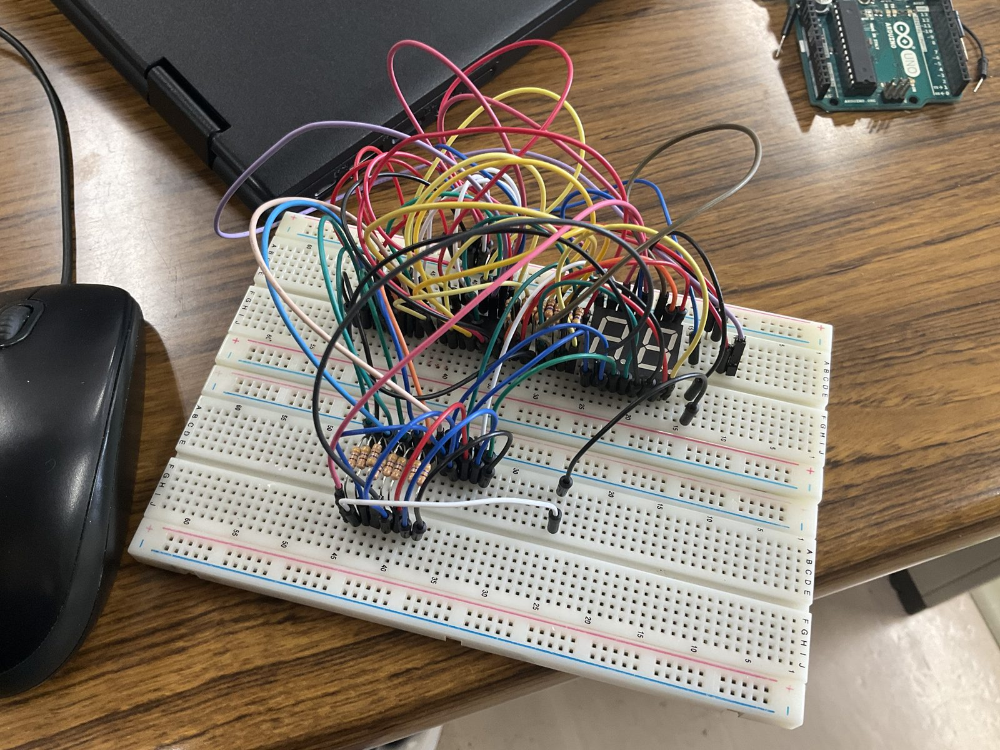

# 7セグ 2桁 単体テスト（74HC595 カスケード）

7セグメントLED **A-552SRD**（2桁・アノードコモン）を、シフトレジスタ
**74HC595 ×2 のカスケード**で駆動する単体テスト。00〜99 をカウントアップする。
[useless-box](../../README.md) 本体とは独立して、表示部の配線を検証する。



## ハードウェア

- 7セグLED: PARA LIGHT **A-552SRD**（2桁・COMMON ANODE）
- シフトレジスタ: **74HC595 × 2**（カスケード接続）
- Arduino UNO 3 / Nano
- 抵抗: 各セグメントに 470Ω（計 7〜8本 ×桁）

## 配線

### Arduino → 74HC595 #1

| Arduino | 74HC595 | 役割 |
|:-------:|:-------:|:-----|
| D8 | ST_CP (12) | ラッチ |
| D12 | SH_CP (11) | クロック |
| D11 | DS (14) | データ |

> ⚠️ このテストのピン割り当ては**本体（`useless_box.ino`）とは異なる**。
> 本体は `D2`=DS / `D3`=SH_CP / `D4`=ST_CP。本体へ移すときは信号線3本を挿し替える。

### 両IC共通の固定配線（忘れやすい）

```
OE   (13) → GND      出力を常時有効化
SRCLR(10) → 5V       クリアを無効化
VCC  (16) → 5V  ／  GND (8) → GND
IC1 の QH'(9) → IC2 の DS(14)   ★カスケード線
SH_CP / ST_CP は IC1・IC2 で共通
各 QA〜QH → 470Ω → 7セグの a,b,c,d,e,f,g,dp
7セグ コモン（14pin=DIG.1 / 13pin=DIG.2）→ 5V
```

## 仕組み

### アノードコモン

A-552SRD はコモン側が＋なので、74HC595 の出力が **LOW のときに点灯**する。
そのため送出時にパターンを `~` でビット反転している。

### ビット順

74HC595 は「最初に送ったビットが QH まで押し出される」ため、`MSBFIRST` で送ると
bit0 が最後に出て QA に残る。よって `bit0=a, bit1=b, … bit7=dp` と対応する。

```cpp
const byte digits[10] = {
  0b00111111, // 0
  0b00000110, // 1
  // …
};
```

### カスケードの送出順

```cpp
shiftOut(dataPin, clockPin, MSBFIRST, ~digits[tens]);  // 先に送る → 奥のIC2（十の位）
shiftOut(dataPin, clockPin, MSBFIRST, ~digits[ones]);  // 後に送る → 手前のIC1（一の位）
```

先に送ったバイトが奥のICへ押し出される。左右が入れ替わって表示されたらこの2行を交換する。

## 検証結果メモ

- 2桁とも点灯を確認（写真は `88` 表示）
- 本体組み込みは同方式（`shiftOut` / `MSBFIRST` / アノードコモン反転）を採用
