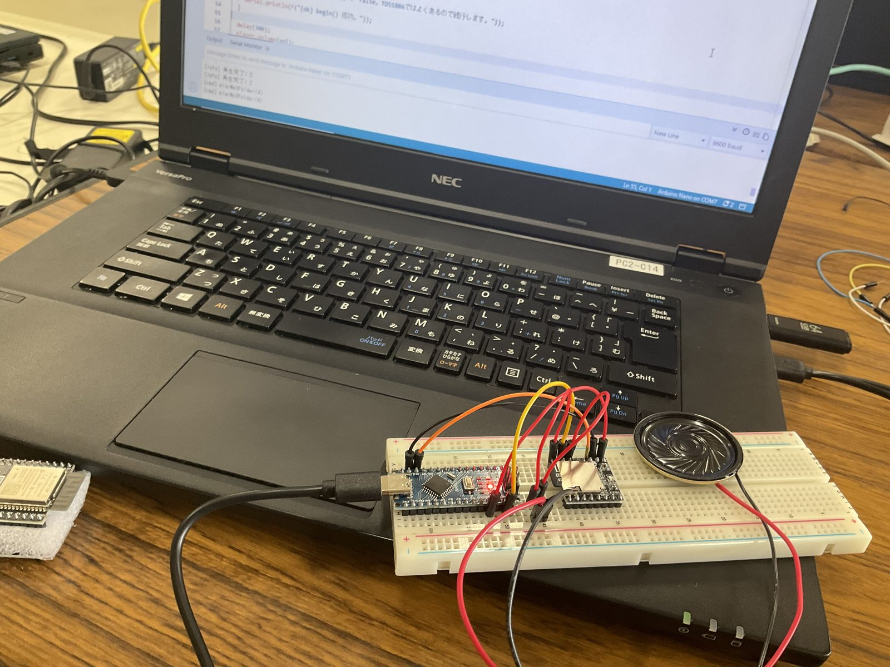

# DFPlayer Mini 単体テスト

音声再生モジュール **DFPlayer Mini** の動作確認用スケッチ。
[useless-box](../../README.md) 本体とは独立して、配線・SD認識・再生を検証する。

## ハードウェア

- DFPlayer Mini（HW-247A / チップ: **TD5580A**）
- Arduino UNO 3
- スピーカー（8Ω 2W 推奨）
- microSD（FAT32・32GB以下）

## 配線

| DFPlayer | 接続先 |
|:---------|:-------|
| VCC (1) | Arduino 5V |
| RX (2) | 1kΩ → Arduino D11 |
| TX (3) | Arduino D10 |
| SPK_1 (6) | スピーカー |
| GND (7) | Arduino GND |
| SPK_2 (8) | スピーカー（**GNDには繋がない**・BTL出力） |

- TX/RX は Arduino と**クロス**する（DFのTX→D10, DFのRX→D11）
- スピーカーは SPK_1 / SPK_2 の2端子のみ。GNDに落とすとアンプが壊れる

## SDカードの準備

1. **FAT32** でフォーマット
2. ルートに **`mp3`** フォルダを作成
3. `mp3/0001.mp3` 〜 `0005.mp3` を **1個ずつ順にコピー**（4桁ゼロ埋め）

> ファイルは `mp3` フォルダに置き、`playMp3Folder(n)` で `/mp3/000n.mp3` を再生する。
> ルート直下に置く場合は `play(n)` を使う（方式が異なるので注意）。

## 使い方

1. ライブラリマネージャで **DFRobotDFPlayerMini** をインストール
2. 書き込み後、シリアルモニタを **9600 baud** で開く
3. 入力欄に1文字送るとコマンド実行

| 入力 | 動作 |
|:----:|:-----|
| `b` | ビープ(0006)を再生（まずこれで配線確認） |
| `r` | 0006 を `play()`（ルート直下方式） |
| `m` | 0006 を `playMp3Folder()`（mp3フォルダ方式） |
| `1`〜`5` | 各トラックを `playMp3Folder` で再生 |
| `+` `-` | 音量調整 |
| `?` | ファイル数・音量を問い合わせ |

起動時に表示される **「SD上のファイル数」** が重要な切り分け材料。
`-1` なら SD を認識できていない（フォーマット/配線を疑う）。

## TD5580A について

このチップは定番の `DFRobotDFPlayerMini` ライブラリで `begin()` が `false` を
返すことがあるが、実際には再生できる場合が多い。本スケッチは begin 失敗でも
停止せず続行し、ACK を無効化している。

## 検証結果メモ

- `playMp3Folder()`（mp3フォルダ方式）で再生成功
- 本体組み込みもこの方式（`playMp3Folder`）を採用する
