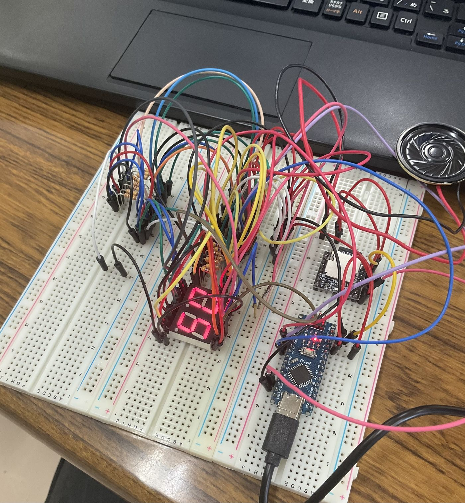

# 7セグ + DFPlayer 統合テスト

本体組み込みの前段階として、**7セグ表示（74HC595×2 カスケード）** と
**DFPlayer 再生** が同じスケッチ内で干渉なく同居できるかを確認するテスト。
番号を指定すると「7セグに2桁ゼロ埋め表示 ＋ 対応する mp3 再生」を同時に行う。



## ハードウェア

- **Arduino Nano 互換**（CH340C / Type-C）※UNO でも同じピンで動く
- 7セグLED A-552SRD（2桁・アノードコモン）× 74HC595 × 2
- DFPlayer Mini HW-247A（チップ TD5580A）＋ 8Ω 2W スピーカー

## ピン割り当て（本体 `useless_box.ino` と同一）

| 用途 | ピン | 接続先 |
|:-----|:----:|:-------|
| 7seg DS | D2 | 74HC595 #1 の 14 |
| 7seg SH_CP | D3 | 74HC595 #1・#2 の 11（共通） |
| 7seg ST_CP | D4 | 74HC595 #1・#2 の 12（共通） |
| DFP TX | D10 | DFPlayer の 3(TX) |
| DFP RX | D11 | 1kΩ → DFPlayer の 2(RX) |

### 595 側の固定配線（両ICに必要・コードに現れない）

```
16(VCC)→5V / 8(GND)→GND / 13(OE)→GND / 10(SRCLR)→5V
#1 の 9(QH') → #2 の 14(DS)   ★カスケード
各 QA〜QG →470Ω→ 7セグ a〜g / コモン(14,13)→5V
```

### DFPlayer 側

```
VCC(1)→5V / GND(7)→GND
TX(3)→D10 / RX(2)→1kΩ→D11
SPK_1(6),SPK_2(8)→スピーカー（GNDに繋がない・BTL出力）
```

## SDカード

FAT32 / ルートに `mp3` フォルダ / `0001.mp3`〜`0005.mp3`（4桁ゼロ埋め）。
`playMp3Folder(n)` で `/mp3/000n.mp3` を再生する。

## 操作（シリアル 9600 baud）

| 入力 | 動作 |
|:----:|:-----|
| `1`〜`5` | その番号を 7セグに **2桁ゼロ埋め表示**（例: `05`）＋ `000n.mp3` 再生 |
| `r` | 1〜5 をランダム発火（直前と同じ番号は避ける＝本体の抽選と同じ） |
| `0` | 表示クリア＋再生停止 |
| `+` `-` | 音量調整 |
| `?` | ファイル数・音量の確認 |

## ⚠️ 書き込み時の注意（Nano 互換機）

Nano 互換機の多くは古いブートローダーを積んでおり、Arduino IDE のデフォルト設定では
`avrdude: stk500_recv(): programmer is not responding` や
`not in sync resp=0x00` が出て書き込めない。

> **ツール → プロセッサ → 「ATmega328P (Old Bootloader)」** を選ぶと書き込める。

本体を Nano で組む際も同じ設定が必要。

## 検証結果メモ

- Nano（Old Bootloader 設定）で書き込み成功
- 7セグに `01`〜`05` のゼロ埋め表示 ＋ 対応 mp3 の同時再生を確認
- 7セグと DFPlayer の同居で干渉なし
- 本体（サーボ込み）統合はこの構成をベースに進める
